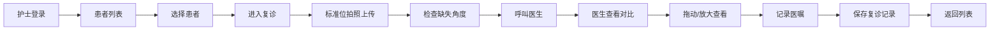

## 1. 产品概述

正畸复诊拍照对比 Web 工作台，面向正畸医生和椅旁护士，核心服务诊室内"拍完立刻看"的场景。护士按标准位上传照片，医生可同屏对比初诊与历次复诊照片，快速评估牙列变化并记录医嘱。

- **目标用户**：正畸科医生、椅旁护士
- **解决痛点**：传统拍照后需要在不同系统间切换查看，对比效率低；标准位照片易遗漏或构图不规范
- **核心价值**：标准位引导拍照 + 同屏拖动对比 + 医嘱一体化记录，提升诊室复诊效率

## 2. 核心功能

### 2.1 用户角色

| 角色 | 使用场景 | 核心操作 |
|------|----------|----------|
| 椅旁护士 | 患者到诊后，按标准位逐一拍照上传 | 选择患者、上传照片、标记缺失角度 |
| 正畸医生 | 查看本次与历史照片对比，写医嘱 | 同屏对比、局部放大、记录医嘱 |

### 2.2 功能模块

1. **患者列表页**：今日预约患者列表，快速进入复诊
2. **复诊详情页**：标准位拍照上传 + 历史对比 + 医嘱记录（一体化页面）
3. **照片对比组件**：左右分栏对比、拖动分割线、缩放平移
4. **医嘱记录模块**：快捷医嘱模板 + 自由文本输入

### 2.3 页面详情

| 页面名称 | 模块名称 | 功能描述 |
|-----------|-------------|---------------------|
| 患者列表页 | 顶部导航 | 诊所名称、日期选择、搜索框 |
| 患者列表页 | 患者卡片列表 | 显示姓名、性别、年龄、复诊次数、预约时间、状态标签 |
| 患者列表页 | 快捷操作 | "开始复诊"按钮直接进入本次复诊 |
| 复诊详情页 | 患者信息栏 | 头像、姓名、复诊编号、日期、阶段标签 |
| 复诊详情页 | 标准位拍照区 | 6宫格标准位（正面微笑、侧貌、45°侧面、上颌咬合、下颌咬合、右侧咬合），灰色示意框提示构图，缺失角红色醒目标记 |
| 复诊详情页 | 历史时间轴 | 初诊 + 历次复诊记录，点击切换对比 |
| 复诊详情页 | 同屏对比区 | 左右双栏对比，中间可拖动分割线，支持滚轮缩放、拖拽平移 |
| 复诊详情页 | 医嘱记录区 | 常用医嘱快捷标签 + 文本框 + 保存按钮 |
| 复诊详情页 | 底部操作栏 | 保存复诊、打印记录、返回列表 |

## 3. 核心流程

护士流程：打开工作台 → 选择今日预约患者 → 进入复诊页面 → 按标准位逐个拍照上传（灰色框辅助构图） → 确认所有角度完成 → 呼叫医生

医生流程：进入复诊页 → 选择对比的历史复诊（如初诊） → 拖动分割线对比牙列变化 → 局部放大查看细节 → 选择/输入医嘱 → 保存本次复诊记录

## 4. 用户界面设计

### 4.1 设计风格

- **主色调**：深青色 #0F766E（teal-700），代表专业医疗感
- **辅助色**：琥珀色 #D97706（amber-600），用于提醒和缺失标记
- **中性色**：以 slate 灰色系为主，干净清爽
- **按钮风格**：圆角 8px，主按钮实色填充，次按钮描边
- **字体**：标题使用 Noto Sans SC Bold，正文使用 Noto Sans SC Regular
- **布局风格**：卡片式布局，清晰分区，医疗级干净感
- **图标**：使用 Lucide 线性图标，简洁专业

### 4.2 页面设计概述

| 页面名称 | 模块名称 | UI 元素 |
|-----------|-------------|-------------|
| 患者列表页 | 顶部导航栏 | 固定高度、左侧诊所名、中间日期选择器、右侧搜索 |
| 患者列表页 | 患者卡片 | 白底卡片、hover 阴影上浮、左侧头像、右侧信息、底部操作按钮 |
| 复诊详情页 | 左侧照片区 | 6宫格布局、每格含灰色占位框/照片、角标显示角度名称、缺失位红色边框 |
| 复诊详情页 | 右侧对比区 | 上下布局：上半部分双栏对比图、下半部分医嘱输入 |
| 复诊详情页 | 对比分割线 | 可拖动竖线、带手柄、悬停高亮 |
| 复诊详情页 | 医嘱区 | 快捷标签可点击添加、文本域自适应高度 |

### 4.3 响应性

- **桌面优先**：主要在诊室电脑/平板上使用，以 1280px 及以上宽度为主要设计目标
- **平板适配**：在 768-1024px 宽度下，对比区改为上下布局
- **触摸优化**：照片上传区域支持点击选择，对比分割线支持触摸拖动
