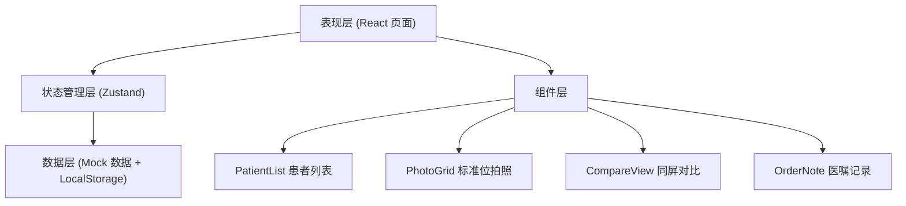
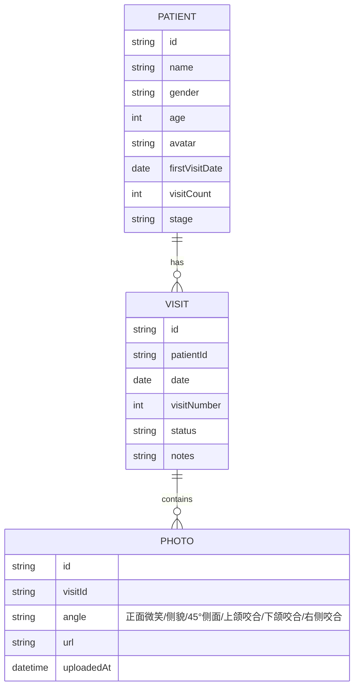

## 1. 架构设计



本项目为纯前端应用，使用 mock 数据模拟后端，数据持久化通过 LocalStorage 实现。

## 2. 技术描述

- **前端框架**：React@18 + TypeScript
- **构建工具**：Vite@5
- **样式方案**：Tailwind CSS@3
- **状态管理**：Zustand@4
- **路由管理**：React Router DOM@6
- **图标库**：Lucide React
- **数据存储**：LocalStorage + Mock 数据

## 3. 路由定义

| 路由 | 页面 | 用途 |
|-------|------|------|
| / | 患者列表页 | 展示今日预约患者，快速进入复诊 |
| /patient/:id | 复诊详情页 | 拍照上传、对比查看、医嘱记录一体化页面 |
| * | 404 页面 | 路径不存在时的兜底页 |

## 4. 数据模型

### 4.1 数据模型定义



### 4.2 TypeScript 类型定义

```typescript
// 患者
interface Patient {
  id: string;
  name: string;
  gender: '男' | '女';
  age: number;
  avatar: string;
  firstVisitDate: string;
  visitCount: number;
  stage: string; // 治疗阶段：如 "排齐整平期"、"收缝期" 等
  todayAppointment?: string; // 今日预约时间
}

// 复诊记录
interface Visit {
  id: string;
  patientId: string;
  date: string;
  visitNumber: number; // 第几次复诊
  status: 'draft' | 'completed';
  notes: string; // 医嘱
  photos: PhotoAngleMap;
}

// 标准位角度枚举
type PhotoAngle = 
  | 'front_smile'    // 正面微笑
  | 'profile'        // 侧貌
  | 'oblique_45'     // 45°侧面
  | 'upper_occlusal' // 上颌咬合
  | 'lower_occlusal' // 下颌咬合
  | 'right_buccal';  // 右侧咬合

// 角度名称映射
const ANGLE_LABELS: Record<PhotoAngle, string> = {
  front_smile: '正面微笑',
  profile: '侧貌',
  oblique_45: '45°侧面',
  upper_occlusal: '上颌咬合',
  lower_occlusal: '下颌咬合',
  right_buccal: '右侧咬合',
};

// 各角度照片映射
type PhotoAngleMap = Partial<Record<PhotoAngle, string>>;
```

## 5. 项目目录结构

```
src/
├── components/          # 通用组件
│   ├── PatientCard.tsx  # 患者卡片
│   ├── PhotoGrid.tsx    # 标准位拍照网格
│   ├── PhotoSlot.tsx    # 单个照片槽位
│   ├── CompareView.tsx  # 同屏对比组件
│   ├── VisitTimeline.tsx # 复诊时间轴
│   └── OrderNote.tsx    # 医嘱记录组件
├── pages/               # 页面
│   ├── PatientList.tsx  # 患者列表页
│   └── VisitDetail.tsx  # 复诊详情页
├── store/               # 状态管理
│   └── useVisitStore.ts # 复诊相关状态
├── data/                # Mock 数据
│   └── mockData.ts      # 模拟患者和复诊数据
├── types/               # 类型定义
│   └── index.ts
├── utils/               # 工具函数
│   └── index.ts
├── App.tsx
├── main.tsx
└── index.css
```

## 6. 核心组件说明

### 6.1 CompareView 同屏对比组件

核心交互组件，实现：
- 左右双图对比
- 中间可拖动分割线（鼠标/触摸）
- 滚轮缩放
- 拖拽平移查看细节
- 同步缩放与平移

### 6.2 PhotoGrid 标准位拍照网格

- 2x3 宫格布局
- 每个槽位有灰色示意框 + 角度名称
- 点击触发文件选择/相机调用
- 缺失角度红色边框标记
- 已上传照片显示缩略图 + 重拍按钮

### 6.3 VisitTimeline 复诊时间轴

- 竖向时间轴布局
- 初诊 + 历次复诊节点
- 点击切换对比对象
- 当前复诊高亮显示
